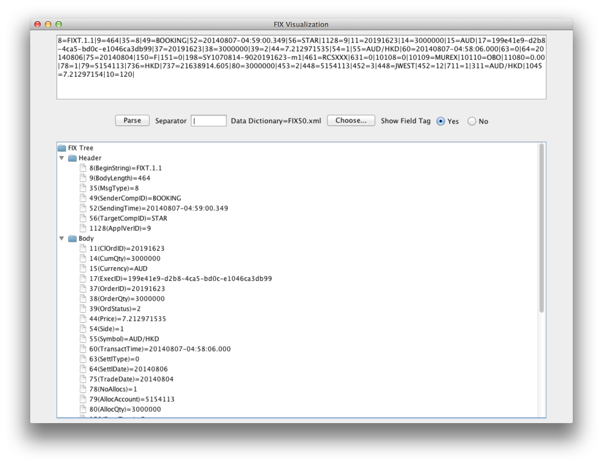

# README #

FixViz is an open source Java tool to show/edit FIX messages.

### How do I get set up? ###

* Checkout the source
* mvn clean install assembly:single
* Run the executable jar produced in the last step.

### Contact ###

* ll97@uowmail.edu.au
